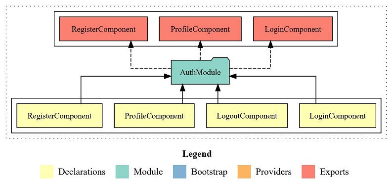

# Angular-Trip-Together
Trip Together represents the culmination of my Angular course at Software University.

It is an integrated project that incorporates a custom RESTful server using Node.js, Express.js, MongoDB with Mongoose, Bcrypt and JsonWebtoken to handle server-side functionalities and backend operations.
The frontend is powered by Angular.

## Description
- Trip Together is a web application that allows users to experience shared trips with other users
- The main objective of the app is to enable users to share a common vehicle to reach their final destination
- Users have the opportunity to create passive income by making use of their cars
- Using a Trip Together app can reduce carbon footprint, potentially save you money
- Lastly, research shows that when users share common transportation, they tend to drive less, making them more environmentally friendly

## Features
<ins>Public part visible without authentication:</ins>
- **Home page** is accessible by all users, includes a button which leads to all available trips if there some
- **Learn more** page includes button with angular animation explaining in simple steps how to use the application and carousel
- **Trips page** includes basic details about the particular trip
- **Sign Up** page (register) expect as input username, email, phone number, gender, password and repeat password, <ins>all fields are required to create a new user</ins>
    - Username should be at least 5 characters long
    - Password should be at least 5 characters long
    - The password and the repeated password should match
- **Login page** expect as input valid email and password

<ins>Private part visible after successful authentication and authorization:</ins>
- **Trips page** give access to all trip details information
    - if the user is not the creator of the trip, there is an option to <ins>join the particular trip</ins> if there are seats available
        - his username and email is dynamically visualized in the trip list of the details page 
        - each user can <ins>join a particular trip only once</ins>
    - if the user is the creator of the trip:
        - **Edit button** is displayed and the trip can be edited
        - **Delete button** is displayed and the trip can be deleted

-  **Weather page** gives logged in users access to search for weather conditions by city name, for example based on their final travel destination
    - Weather API https://open-weather13.p.rapidapi.com

- **Create page**, each user can create their own trips:
    - all fields in the form are required with different validations, if the form does not meet all the validations, the submit button is disabled

- **Search page**, users can search among all created trips for a particular trip, based on their starting or end point. If there is a match from the search, all results are rendered, users also access details as well

- **Profile page**:
    - contains a section with personal information about the user's account
    - user has the option to **edit** his personal information through the **edit profile button**
    - **avatar picture** is dynamic based on the gender of the logged in user
    - contains a **dynamic list** of all trips created by the user with a **link** to details for each specific trip

- Implemented **error handling** and **data validation** for all forms to prevent crashes caused by entering invalid data

## Security
The project incorporates several security enhancements:

- **Guards**: Various features have guards in place to control access based on user authentication status
- **Custom 404 Page**: An exclusive 404 page is implemented to handle undefined routes gracefully
- **JWT Blacklist**: To enhance security, a blacklist system stores every used JSON Web Token (JWT) after a user logs out

## Additional libraries
- Angular Material https://material.angular.io/
- Font Awesome https://fontawesome.com/
- Compodoc https://compodoc.app/ 

## Installation
To run Trip Together locally, follow these steps:
1. Clone the repository to your local machine
2. Navigate to the project's root directory in your terminal
3. Install the dependencies of both trip together app and rest server, using the package manager of your choice
4. Start the REST with "npm start" command and the application with "ng serve" command
5. Open your browser and go to `http://localhost:4200/` to access the application

## Deployment
TODO!!

## Project architecture
- App Module

- Auth Module

- Core Module

- Features Module

- Shared Module
